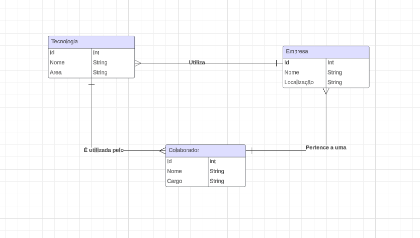

# Projetoindividual2

<h2>Contexto</h2>
Você foi contratado para desenvolver um banco de dados que irá armazenar dados importantes que será utilizado pelo sistema RESILIADATA.

➔ O sistema irá auxiliar na avaliação de quais são as tecnologias que as empresas parceiras estão utilizando e quem são seus colaboradores;

➔ Vamos ter o cadastro de empresas parceiras, cadastro de tecnologias com a opção de selecionar a área (webdev, dados, marketing, etc.), uma tabela para registrar quais tecnologias as empresas estão utilizando e uma tabela para cadastro de colaboradores.

1. **Entidades Necessárias:**
   - Empresa
   - Tecnologia
   - Colaborador

2. **Principais Campos e Tipos:**
   - **Empresa:**
     - ID (chave primaria, numérico)
     - Nome (varchar (200))
     - Localização (varchar (200))
   - **Tecnologia:**
     - ID (chave primaria, numérico)
     - Nome (varchar (200))
     - Área (varchar (200))
   - **Colaborador:**
     - ID (chave primaria, numérico)
     - Nome (varchar (200))
     - Cargo (varchar (200))

3. **Relacionamentos:**
   - Uma Empresa pode utilizar várias Tecnologias.
   - Um Colaborador pode pertencer a uma Empresa.

4. **Simulação de Registros:**
   - **Empresa:**
     - ID: 1, Nome: "Empresa A", Localização: "Cidade X"
     - ID: 2, Nome: "Empresa B", Localização: "Cidade Y"
   - **Tecnologia:**
     - ID: 1, Nome: "Python", Área: "Desenvolvimento"
     - ID: 2, Nome: "SQL", Área: "Banco de Dados"
   - **Colaborador:**
     - ID: 1, Nome: "João", Cargo: "Desenvolvedor"
     - ID: 2, Nome: "Maria", Cargo: "Analista"
    
       
